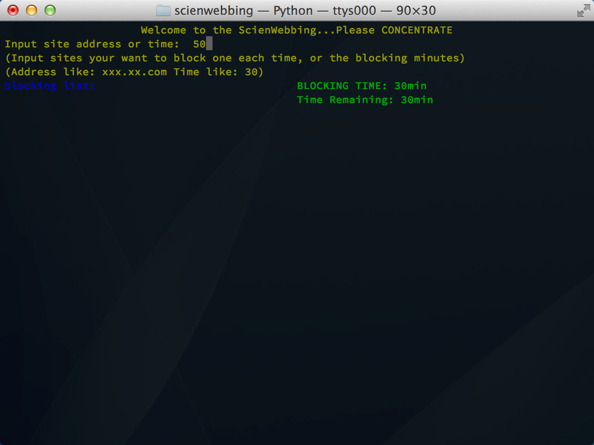
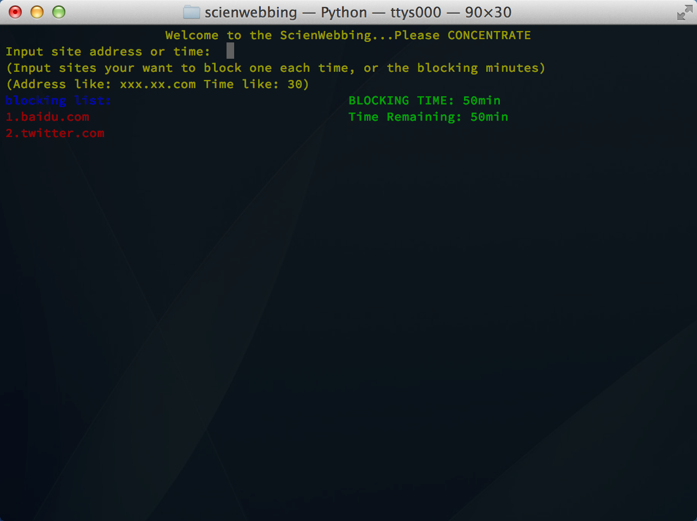
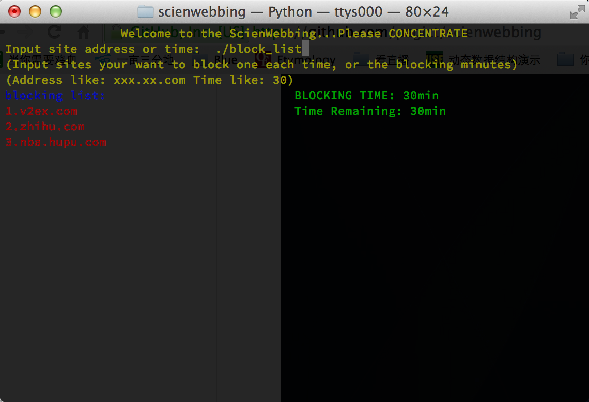
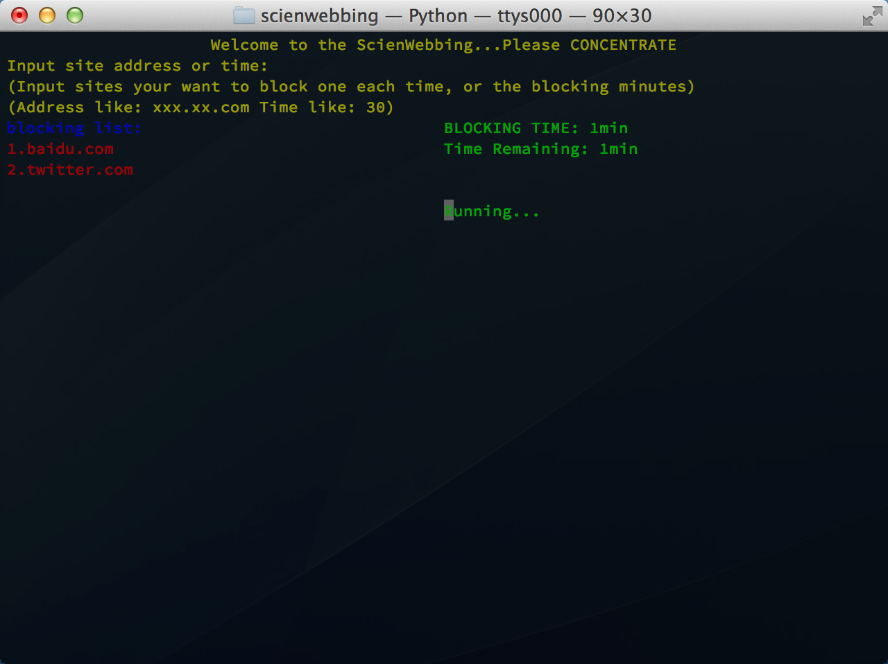
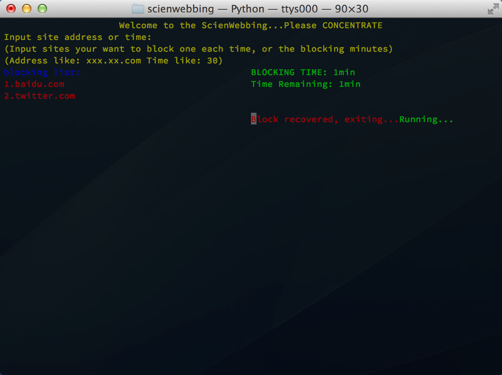

This idea comes from my friend while I asked him for a idea to initially bring my Python skill to life.

___So this project helps to block specific sites in a given time for focusing on your current task with network availability.___

####To Do List
- ~~block some affixed sites in a fix duration (hard logic code, manipulate with hosts file)~~
- ~~UI (first in posix system only)~~
- ~~import site list from a file~~
- ~~Capture packets instead of hosts file~~
- Monitor browsers. Add time punishment while trying to access the blocking sites in the time
- ~~Self persistence. Persistent while closing the terminal~~
	
####Known bug
- fail to exit curses mode correctly
- fail to check the URL availability
- ~~**Need to flush local DNS cache if your site opened recently**~~

###How to
####Install and Uninstall
In Linux/OS X

	sudo python setup.py install
	
 for installation, and:
 	
 	sudo python setup.py uninstall
 for uninstallation.
 
 After installation, you can trigger it anywhere with:
 
 	sudo scienWebbing
In Windows
(The author hasn't know yet either)

####Begin
1. Input digit to set minutes, default as 30mins
	
2. Other than digit would treated as sites
	
3. You can reset your time again
	
4. You can import your list
	
4. Hit enter to run...
	
5. When time's up, finish
	
